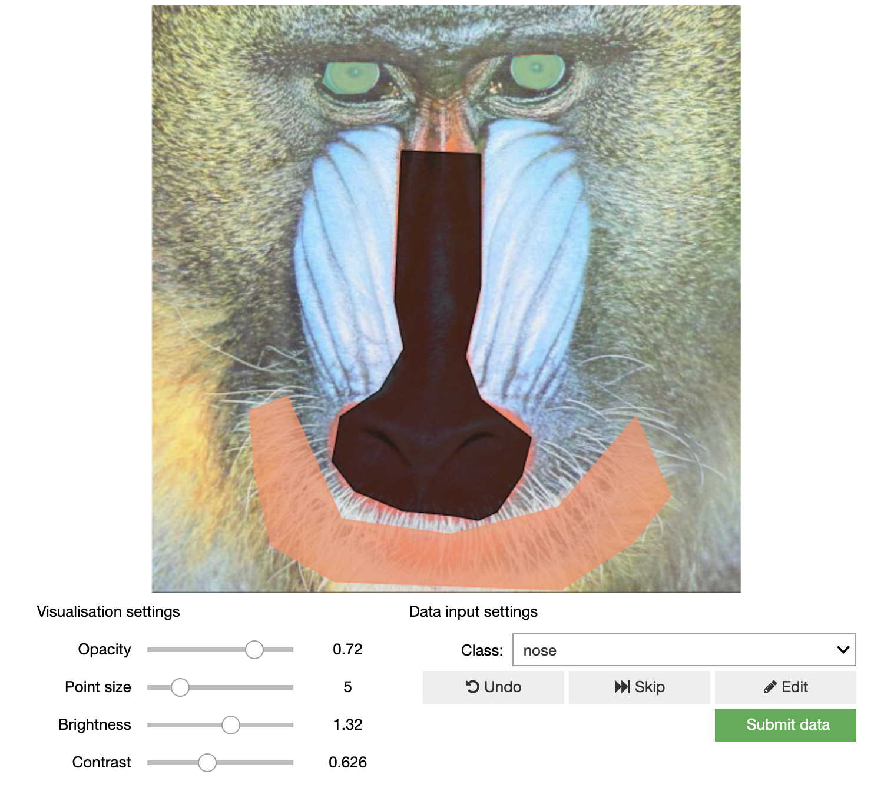

# `ipyannotations`: create rich annotations in jupyter notebooks.

The `ipyannotations` library is designed to let you create rich annotations
for your data (currently, primarily images) inside jupyter notebooks. It lets
you leverage the rich jupyter display system from python. It was designed to
integrate with `superintendent`, but does not need to.

For example, draw polygons onto images for your machine learning applications:

.. toctree::
   :maxdepth: 2
   :caption: Contents:

   installation
   quick-start
   api

## Indices and tables

* :ref:`genindex`
* :ref:`modindex`
* :ref:`search`
